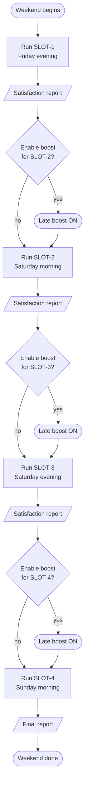
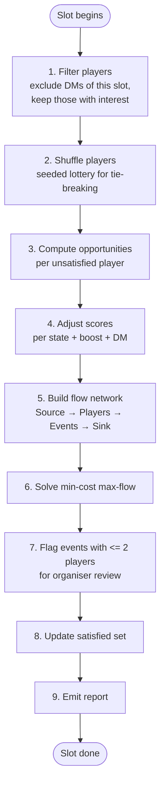
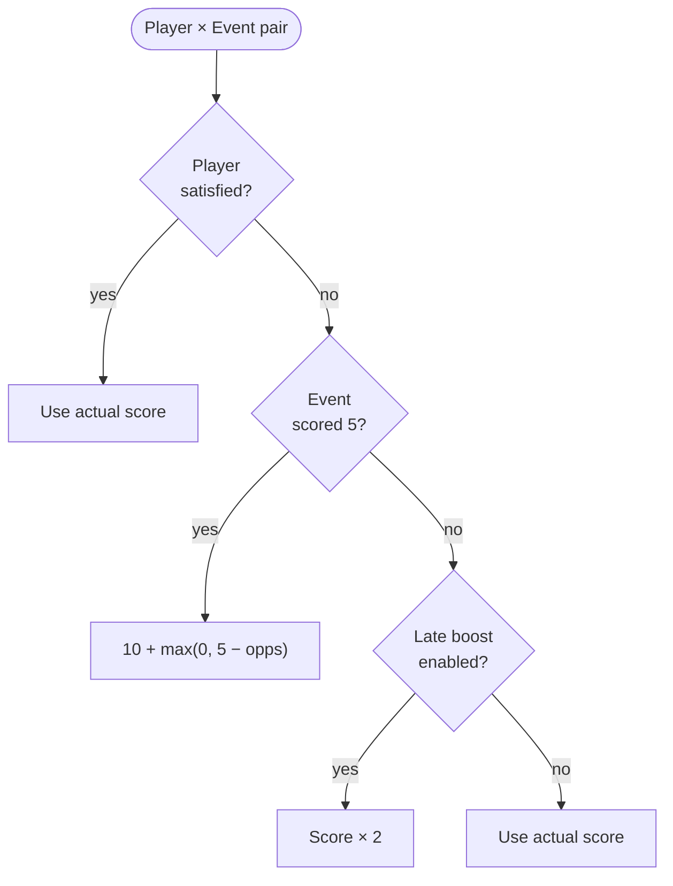
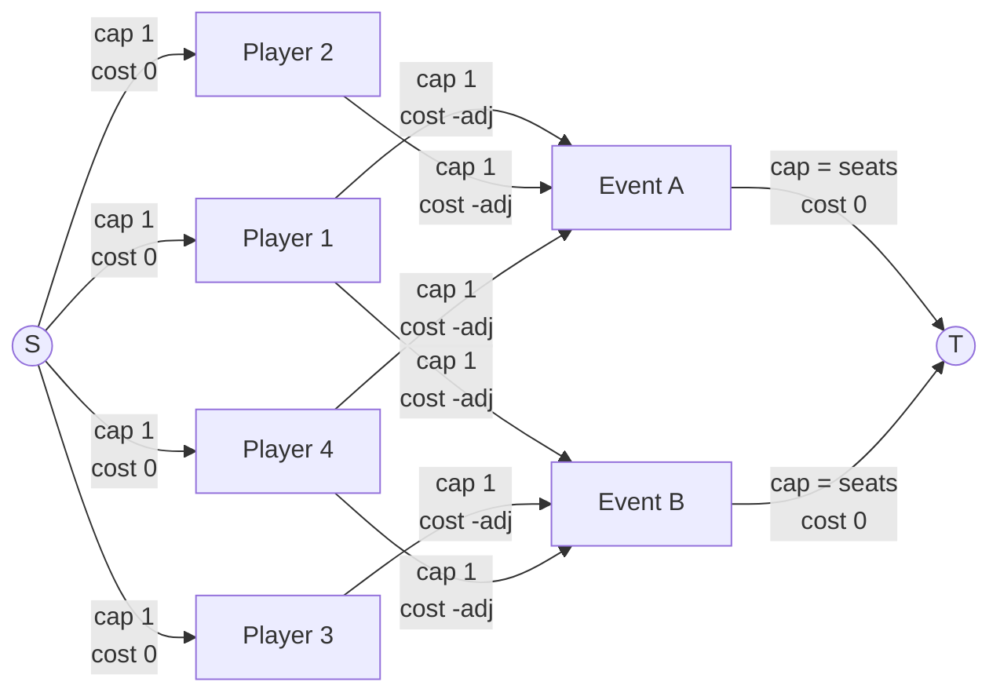
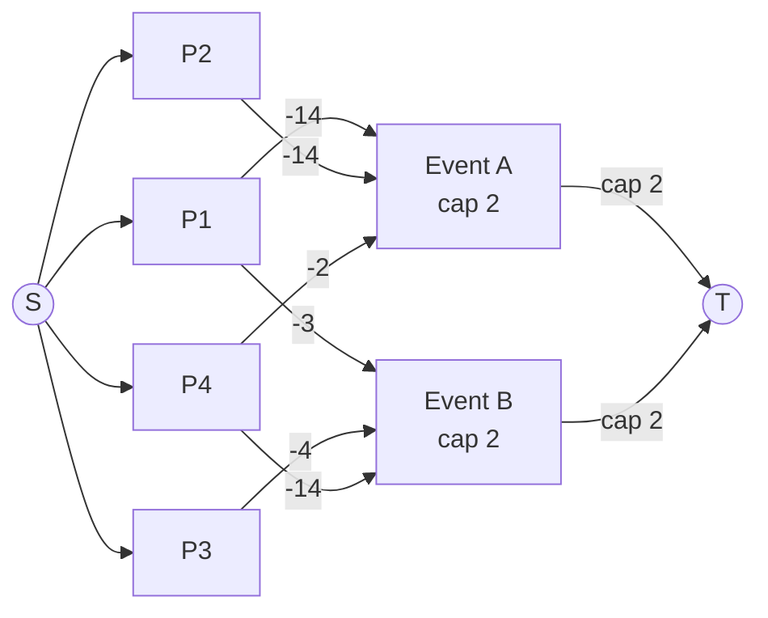

# Algorithm: Puljefordeling

## Overview

The algorithm runs **once per SLOT**, in order. Each run takes the current satisfaction state of all players, adjusts their preference scores based on that state and the organizer's boost settings, then solves the assignment as a **min-cost max-flow** problem on a bipartite graph.

This is not a single global optimization over the whole weekend. The slot-by-slot model is intentional: between runs, the organizer inspects the result, makes any manual fixes, and decides whether to enable the late boost for the next slot.

---

## Weekend Flow



---

## State

A single piece of mutable state is carried across slot runs:

- **Satisfied set**: the set of PLAYERs who have been assigned at least one EVENT they scored 5 at any point in the weekend so far.

All other data (events, capacities, player preferences) is read-only input.

---

## Per-Slot Procedure



### Step 1 — Filter players

Collect all PLAYERs who have expressed at least one interest (score ≥ 1) in the current SLOT. Players with no interest in this SLOT are skipped entirely.

### Step 2 — Shuffle players

Shuffle the filtered player list using a **seeded PRNG** before building the graph. This makes tie-breaking (equal adjusted scores competing for the same seat) random but reproducible.

The seed is derived from the convention year and the slot's position in the weekend:

```
seed = year × 1000 + slotIndex   (e.g. slot 3 of 2026 → seed 2026002)
```

Results are consistent within a year and automatically different next year. The seed is included in the slot report.

### Step 3 — Adjust scores

For each unsatisfied player, first compute `opportunities` — the number of remaining slots (including this one) where they have at least one score-5 event.

Then, for each (player, event) pair where the player has an interest, compute an **adjusted score**:



| Player state | Event score | Late boost | Adjusted score |
|---|---|---|---|
| Unsatisfied | 5 | either | **10 + max(0, 5 − opportunities)** |
| Unsatisfied | 1–4 | yes | **score × 2** |
| Unsatisfied | 1–4 | no | score |
| Satisfied | any | either | score |

The scarcity bonus on score-5 edges (1 opp → +4, 2 → +3, … 5+ → +0) ensures players whose only score-5 chance is in this slot outrank players who have other slots to fall back on. The exact magnitudes don't matter — MCMF only cares about ordering — but the small bonus is enough to break ties between unsatisfied players competing for the same score-5 seat.

### Step 5 — Build the flow network



- **S → Player**: capacity 1, cost 0. Each player can be assigned at most once.
- **Player → Event**: capacity 1, cost = −(adjusted score). Edge exists only if the player rated this event. Cost is negated because min-cost flow minimises — negating the score turns the maximisation into a minimisation.
- **Event → T**: capacity = event's seat limit, cost 0.

### Step 6 — Solve min-cost max-flow

Run min-cost max-flow from S to T.

- **Max flow** ensures as many players as possible are assigned (subject to event capacities).
- **Min cost** (over negated scores) ensures total preference satisfaction is maximised among all assignments with equal flow.

### Step 7 — Flag undersubscribed events

After solving, scan all events: any event with **2 or fewer assigned players** is added to `UndersubscribedEvents` in the result. The threshold is hardcoded (`minViablePlayers = 3`) — three players is roughly the minimum for most tabletop games to be worth running, so anything below that is flagged.

**The algorithm does not change assignments for undersubscribed events.** This is a deliberate choice — automatic changes have too many edge cases (cascading effects, "savable vs doomed" judgments, displaced players with no fallback) that the algorithm can't resolve well without human context. Instead, the flagged list goes to the organisers, who can:

- Talk to the assigned players about swapping
- Merge a small group with another table
- Accept a smaller-than-usual group

### Step 8 — Update satisfaction state

For each player assigned to an event they scored 5 in this slot, add them to the satisfied set if not already present.

### Step 9 — Emit report

Output for this slot:
- **Assignment map**: which players go to which event.
- **Undersubscribed events**: events with 2 or fewer players — flagged for organiser review.
- **Unassigned players**: had interest but couldn't be placed (e.g., all their rated events were full).
- **Newly satisfied players**: those who received their first score-5 assignment this slot.
- **Running totals**: satisfied / total players with any 5-score across the weekend.
- **Total score**: sum of actual (unadjusted) scores across all assignments this slot.
- **Tie-breaking seed**: used for the shuffle.

---

## Flow Network — Example

4 players, 2 events (capacity 2 each), late boost off, all players unsatisfied.

```
Preferences:       Adjusted scores (5 → 14, because each player has 1 remaining score-5 opportunity):
  P1: A=5, B=3       P1→A: 14   P1→B: 3
  P2: A=5            P2→A: 14
  P3: B=4            P3→B:  4
  P4: A=2, B=5       P4→A:  2   P4→B: 14
```



Optimal flow (total cost −46, maximum):

| Event | Assigned players |
|---|---|
| A | P1, P2 |
| B | P3, P4 |

All 4 players are assigned this slot. P1, P2, and P4 are newly satisfied because they got a score-5 event; P3 had no score-5 preference and is not part of the satisfaction count.

---

## Complexity

For a single slot with **P** players and **E** events:

| Component | Size |
|---|---|
| Nodes | O(P + E) |
| Edges | O(P × E) worst case |
| Flow augmentations | At most O(P), because each player can contribute at most one unit of flow |
| One SPFA pass | O(V × A), where V is graph nodes and A is graph edges |
| Total min-cost max-flow | O(F × V × A), where F is the final number of seated players |

Here, `V = O(P + E)`, `A = O(R + P + E)`, `R` is the number of rated player/event preferences in the slot, and `F <= P`. In the dense worst case, `R = P × E`. For realistic convention sizes (around 200 players and 5-7 events per slot), each slot should still solve quickly, but SPFA does not have a logarithmic shortest-path bound.

---

## Tweaks: numbers, fairness, and considerations

The algorithm contains several numeric constants that encode design tradeoffs. None of these values are sacred — they were chosen to produce intuitive orderings, but you can re-tune them.

### The numbers

| Tweak | Formula | Range |
|---|---|---|
| Score-5 base boost (unsatisfied) | `2 × MaxScore` | constant 10 |
| Scarcity bonus (unsatisfied score-5) | `max(0, 5 − opportunities)` | 0..4 |
| Late boost (unsatisfied score 1–4) | `score × 2` | 2..8 |
| DM bonus (any edge for a DM) | `+10` | constant |

### Combined adjusted scores

The full table of edge weights, depending on who the player is and which event they're rating:

| Player category | Edge type | Without late boost | With late boost |
|---|---|---|---|
| Regular, satisfied | any score | 1..5 | 1..5 |
| Regular, unsatisfied | score 1–4 | 1..4 | 2..8 |
| Regular, unsatisfied | score 5 | 10..14 | 10..14 |
| DM, satisfied | any score | 11..15 | 11..15 |
| DM, unsatisfied | score 1–4 | 11..14 | 12..18 |
| DM, unsatisfied | score 5 | 20..24 | 20..24 |

### Why these specific numbers?

**Score-5 base = 10 (= 5×2)**. Pure doubling. Large enough that unsatisfied score-5 outranks any boosted lower-score edge (max 8). Arbitrary but readable.

**Scarcity cap = 5**. Differentiates players with 1–5 score-5 opportunities; beyond 5 there's no further granularity. A weekend only has 4 slots, so this cap is generous in practice.

**Late boost = ×2**. Same shape as the score-5 doubling. Big enough that an unsatisfied score-4 (→8) outranks a satisfied score-5 (5), giving organizers a strong knob to push unsatisfied players over the finish line in late slots.

**DM bonus = +10**. Large enough that a DM with any positive edge competes with regular score-5 holders. This is the strongest single bonus — it reflects that DMs are *contributing* to the convention, not just attending.

### Known unfairness and edge cases

These are the cases where the algorithm produces results some participants will find surprising. Knowing about them helps organizers calibrate the numbers — or explain outcomes when asked.

#### A DM with score 1 can beat a regular player with score 5

DM score-1 = `1 + 10 = 11`. Regular unsatisfied score-5 with abundant opportunities = `10`.

A DM who *barely* wants an event can take the seat from a player who *really* wants it. This is the deliberate price of compensating DMs. Lower the DM bonus if this feels too strong.

#### Late boost compresses preference differences

With late boost on, unsatisfied scores 1..4 become 2..8. The doubling compresses relative differences — score-3 (→6) is no longer clearly behind score-4 (→8) the way 3 was clearly behind 4. Players with mild interest can leapfrog players with stronger interest just because they have a slightly higher raw rating.

#### A DM with no score-5 stays "unsatisfied" forever

If a DM never gives any event a 5, they can never be marked satisfied. They still get their DM bonus on every edge, so they get good assignments — but the satisfaction metric will undercount them. This is cosmetic: their adjustments are still working.

### Considerations for tuning

If you re-tune these numbers, **preserve the priority ordering**, not the magnitudes. MCMF only cares about which costs are smaller than which — not by how much.

The intended ordering, weakest to strongest, is roughly:

1. Satisfied players on low-score events
2. Unsatisfied non-DM players on low-score events (boosted if late-boost on)
3. Satisfied players on score-5 events
4. Unsatisfied non-DM players on score-5 events (scarcity bonus differentiates)
5. DM players (any edge, ranked further by their underlying type)
6. Unsatisfied DM players on score-5 events with scarcity

A useful sanity check: dump the adjusted scores for one contentious slot and verify the ordering matches your intuition. If two categories you didn't intend to tie end up tied, raise one of the constants by 1 — that's usually enough.

---

## Organizer Control Points

The algorithm exposes one decision point per slot before it runs:

> **Enable late boost?** (yes / no)

The organizer checks the satisfaction report from prior slots and sets this flag. The algorithm itself makes no automated decision about when to apply the boost — that judgment is left to the humans running the event.
