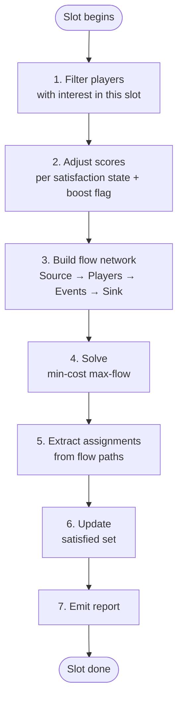
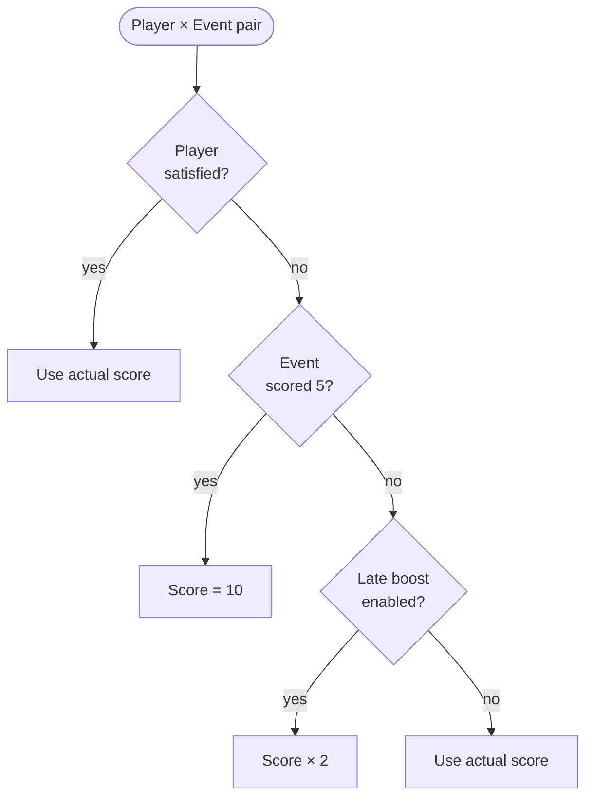
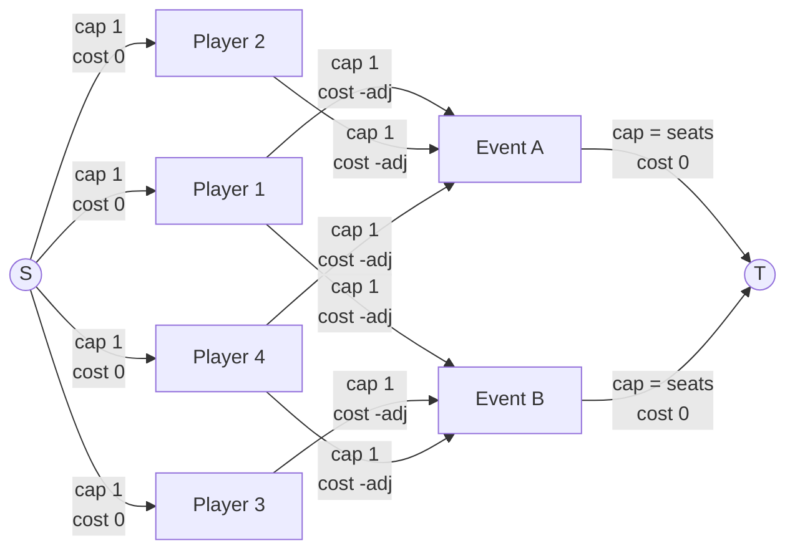

# Algorithm: Puljefordeling

## Overview

The algorithm runs **once per SLOT**, in order. Each run takes the current satisfaction state of all players, adjusts their preference scores based on that state and the organizer's boost settings, then solves the assignment as a **min-cost max-flow** problem on a bipartite graph.

Between runs, the organizer inspects a satisfaction report and decides whether to enable the late boost for the next slot.

---

## Weekend Flow


---

## State

A single piece of mutable state is carried across slot runs:

- **Satisfied set**: the set of PLAYERs who have been assigned at least one EVENT they scored 5 at any point in the weekend so far.

All other data (events, capacities, player preferences) is read-only input.

---

## Per-Slot Procedure



### Step 1 — Filter players

Collect all PLAYERs who have expressed at least one interest (score ≥ 1) in the current SLOT. Players with no interest in this SLOT are skipped entirely.

### Step 2 — Adjust scores

For each (player, event) pair where the player has an interest, compute an **adjusted score**:



| Player state | Event score | Late boost enabled? | Adjusted score |
|---|---|---|---|
| Unsatisfied | 5 | either | **10** |
| Unsatisfied | 1–4 | yes | **score × 2** |
| Unsatisfied | 1–4 | no | score |
| Satisfied | any | either | score |

### Step 3 — Build the flow network



- **S → Player**: capacity 1, cost 0. Each player can be assigned at most once.
- **Player → Event**: capacity 1, cost = −(adjusted score). Edge exists only if the player rated this event. Cost is negated because min-cost flow minimises — negating the score turns the maximisation into a minimisation.
- **Event → T**: capacity = event's seat limit, cost 0.

### Step 4 — Solve min-cost max-flow

Run min-cost max-flow from S to T.

- **Max flow** ensures as many players as possible are assigned (subject to event capacities).
- **Min cost** (over negated scores) ensures total preference satisfaction is maximised among all assignments with equal flow.

### Step 5 — Extract assignments

Each unit of flow along a path `S → Player_i → Event_j → T` represents player `i` assigned to event `j`. Collect these into the assignment map `Event → []Player`.

### Step 6 — Update satisfaction state

For each player assigned to an event they scored 5 in this slot, add them to the satisfied set if not already present.

### Step 7 — Emit report

Output for this slot:
- Assignment map: which players go to which event.
- Players with interest but left unassigned (wanted to play, no seat available).
- Players newly satisfied this slot.
- Running totals: satisfied / total players with any 5-score across the weekend.
- Total adjusted score sum for this slot.

---

## Flow Network — Example

4 players, 2 events (capacity 2 each), late boost off, all players unsatisfied.

```
Preferences:       Adjusted scores (5 → 10):
  P1: A=5, B=3       P1→A: 10   P1→B: 3
  P2: A=5            P2→A: 10
  P3: B=4            P3→B:  4
  P4: A=2, B=5       P4→A:  2   P4→B: 10
```


Optimal flow (total cost −34, maximum):

| Event | Assigned players |
|---|---|
| A | P1, P2 |
| B | P3, P4 |

All 4 players satisfied this slot (P1, P2, P4 got a score-5 event; P3 had no score-5 preference).

---

## Complexity

For a single slot with **P** players and **E** events:

| Component | Size |
|---|---|
| Nodes | O(P + E) |
| Edges | O(P × E) worst case |
| Min-cost max-flow | O(P × E × log(P + E)) with SPFA / Dijkstra + potentials |

For realistic convention sizes (200 players, 7 events), each slot solves in milliseconds.

---

## Organizer Control Points

The algorithm exposes one decision point per slot before it runs:

> **Enable late boost?** (yes / no)

The organizer checks the satisfaction report from prior slots and sets this flag. The algorithm itself makes no automated decision about when to apply the boost — that judgment is left to the humans running the event.
