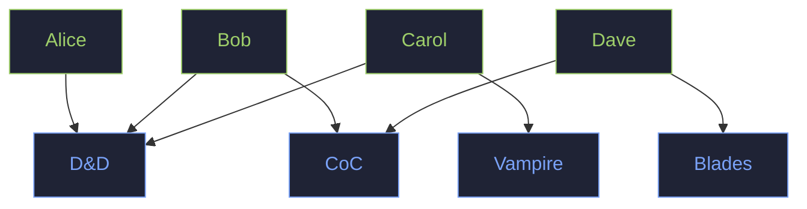
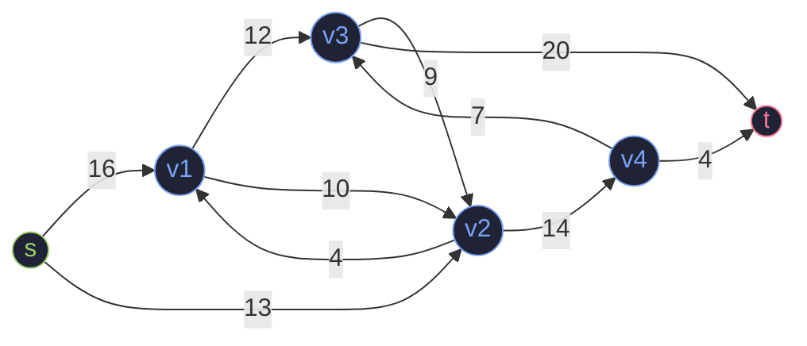
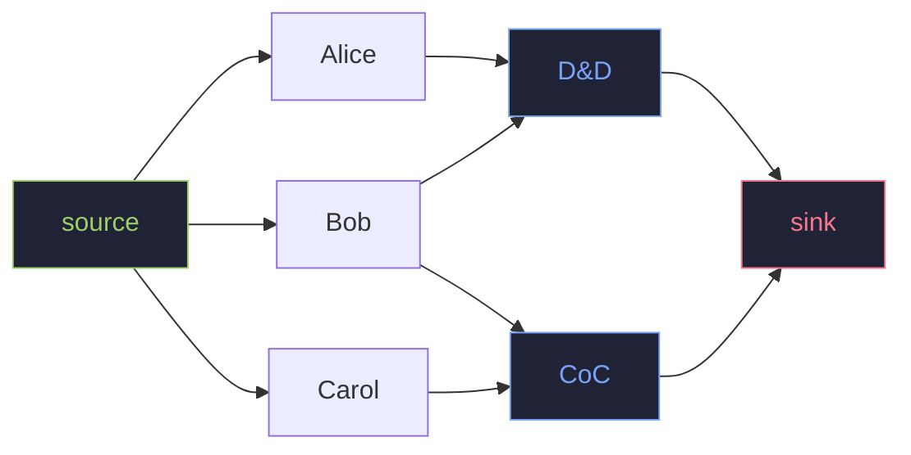
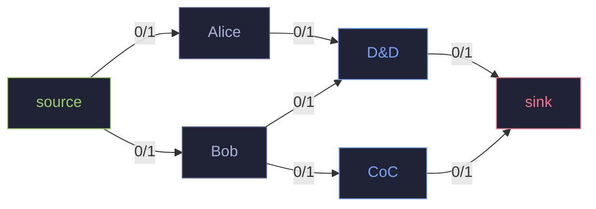
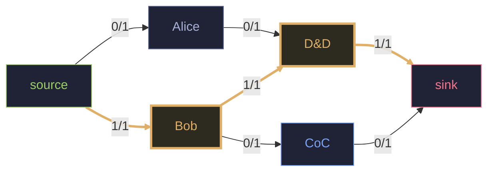
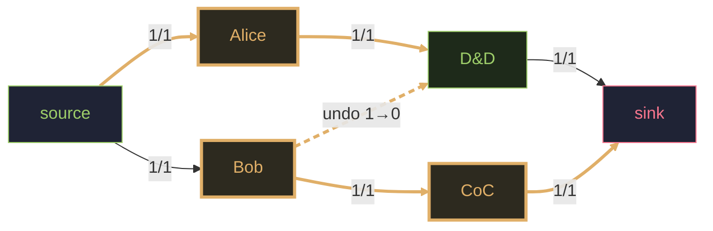
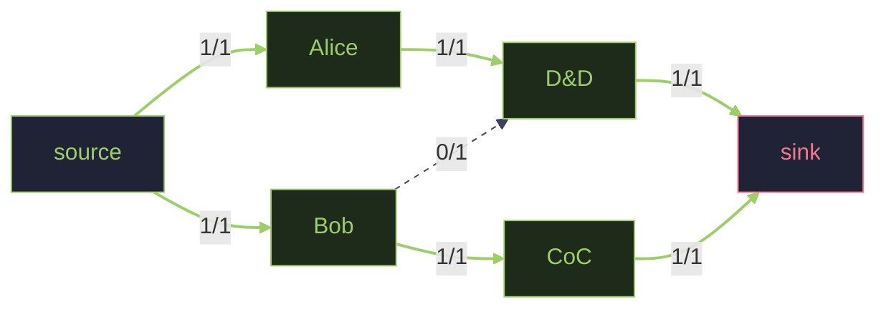
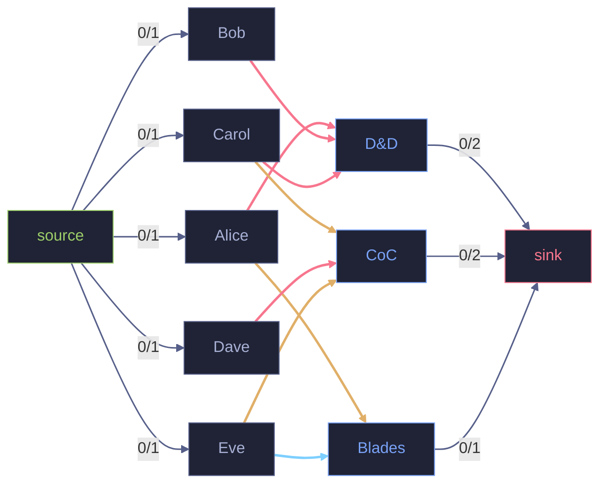
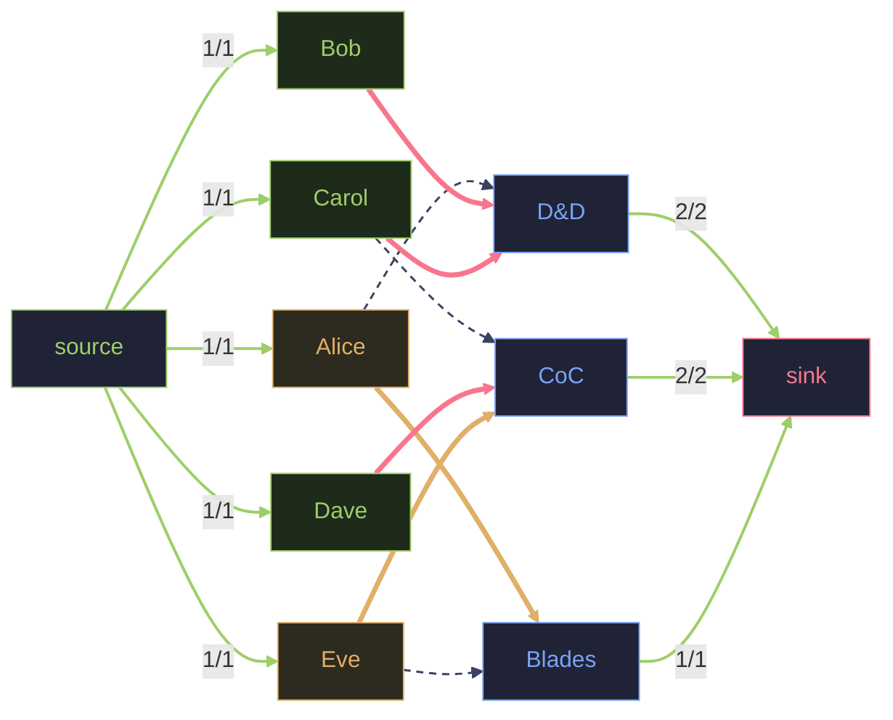
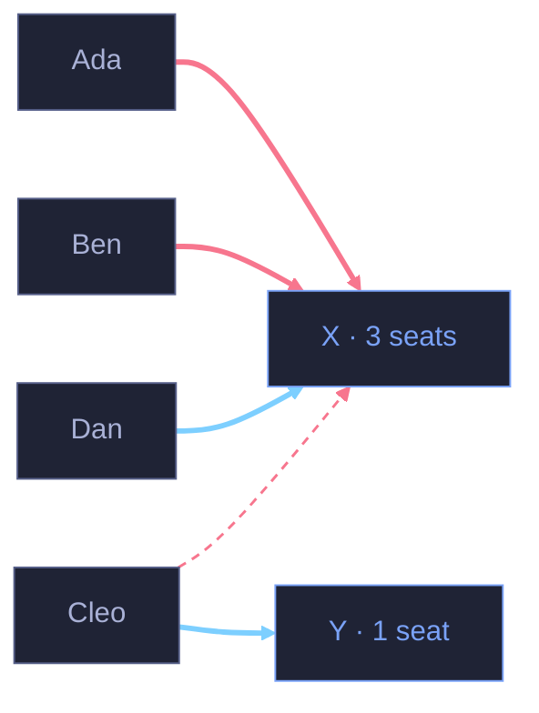

# Puljefordeling

Hvem sitter hvor, rettferdig (sånn passe)

<div class="muted mt-4 text-sm">Oskar &nbsp;→&nbsp; Regncon</div>

---
layout: center
class: text-center
---

# The minimum-cost flow problem

$$
\begin{aligned}
\textbf{minimize} \quad & \sum_{(u,v)\in E} a(u,v)\cdot f(u,v) \\[1.2em]
\textbf{s.t.}\quad
& f(u,v) \le c(u,v)  && \text{\small capacity} \\
& f(u,v) = -f(v,u)  && \text{\small skew symmetry} \\
& \textstyle\sum_{w\in V} f(u,w) = 0  && \text{\small conservation } (u \neq s,t) \\
& \textstyle\sum_{w\in V} f(s,w) = d = \sum_{w\in V} f(w,t)  && \text{\small required flow}
\end{aligned}
$$

---
layout: center
class: text-center
---

## … pust.

<v-click>

Hele foredraget er - enkelt og greit:

> ## Hvem sitter Hvor, noenlunde rettferdig.

</v-click>

---

# Hvordan vi typik har sett for oss problemet

Et regneark. Spillere nedover, spill bortover, et merke der noen er interessert:

```text
              D&D     CoC    Blades   Vampire
   Alice       ✓                ✓
   Bob         ✓       ✓
   Carol       ✓                         ✓
   Dave                ✓        ✓
   …
```

<v-click>

## Så bare… fyll det ut! 
  - Ett spill per person.
  - Ikke overfyll et bord. 
  - Hold det rettferdig.

Og det finnes **fire** slike rutenett — ett per pulje — hver dag.

</v-click>

---

# Så da kan vi jo bare prøve alle permutasjoner!?

<v-click>
Hver spiller velger ett av spillene sine. Gang det ut:

<div class="text-center my-6 text-xl">

$$ \underbrace{150}_{\text{spillere}} \times \underbrace{5}_{\text{valg hver}} \;\Rightarrow\; 5^{150} \approx 10^{104} \text{ kombinasjoner} $$

</div>
</v-click>

<v-click>

Det er mer enn antall atomer i universet ($\approx 10^{80}$).

</v-click>

<v-click>

<div class="text-center text-3xl mt-6" style="color:#f7768e;font-weight:800">
Ja — der har vi det! 
# NP-COMPLETE! 😱
</div>

</v-click>

---
layout: center
class: text-center
---

# P vs NP — the map

<div class="flex justify-center my-2">
<svg viewBox="0 0 480 300" width="460" style="max-height:300px">
  <!-- NP-Hard (left) -->
  <ellipse cx="175" cy="150" rx="140" ry="125" fill="#f7768e1a" stroke="#f7768e" stroke-width="2"/>
  <!-- NP (right) -->
  <ellipse cx="305" cy="150" rx="140" ry="125" fill="#7aa2f71f" stroke="#7aa2f7" stroke-width="2"/>
  <!-- P (inside NP, right) -->
  <ellipse cx="375" cy="175" rx="52" ry="52" fill="#9ece6a26" stroke="#9ece6a" stroke-width="2"/>

  <text x="105" y="155" text-anchor="middle" fill="#f7768e" font-size="5" font-weight="700">NP-Hard</text>
  <text x="240" y="155" text-anchor="middle" fill="#bb9af7" font-size="5" font-weight="700">NP-Complete</text>
  <text x="370" y="102" text-anchor="middle" fill="#7aa2f7" font-size="5" font-weight="700">NP</text>
  <text x="375" y="183" text-anchor="middle" fill="#9ece6a" font-size="5" font-weight="800">P</text>
</svg>
</div>

<div class="muted text-sm">If a problem is <span style="color:#bb9af7">NP-complete</span>, nobody knows a fast (polynomial) way — brute force is all we've got.</div>

<v-click>

> But seating **isn't** NP-complete. It's an assignment / **min-cost-flow** problem — squarely in **P**. An exact, *fast* algorithm exists. We just have to stop staring at the grid and **draw it as a graph.**

</v-click>

---

# Først, hvorfor er alle "obvious" metoder dårlige?

<v-click>

## First come first serve
- Andre gjør det, og folk hater det! Den raskeste **klikkeren** vinner. Det er ikke rettferdig, det er en reflekstest.

</v-click>

<v-click>

## Greedy

**Greedy** (sett hver person i favoritten sin, etter tur):

```text
   Bob vil ha D&D eller CoC   →  greedy setter Bob i D&D (siste plass)
   Alice vil bare ha D&D      →  fullt!  Alice får ingenting.

   Bedre:  Bob → CoC,  Alice → D&D   →  begge fornøyde.
```

Greedy kan ikke **undo**-e et tidlig valg. Rekkefølgen avgjør utfallet. Dårlig.

</v-click>

---

# Så vi TEGNER det

Folk øverst, spill nederst; en strek = «interessert». Streker går bare mellom de to gruppene — det er en **bipartite** graf.



---

# Max-flow = min-cut



---

# Så hvordan sørge for at alle får en plass?

Legg til en **source** som mater hver person, og et **sink** hvert spill tømmes i. Hvert spill rommer like mange som det har **plasser**.



**Max-flow:** dytt så mange «person→seat»-enheter som får plass. Det smaleste snittet = flest mulig vi kan plassere.

---

# La oss se på det typiske problemet

Alice vil **bare ha D&D**. Bob vil ha **D&D eller CoC**. Én plass hver.

<div class="muted text-sm">Tall på kantene = <strong>flow / capacity</strong>.</div>



---

# Step 1 — push any path

`source → Bob → D&D → sink`. Bob har fått plass (oransje). **1 plassert.**



---

# Step 2 — Alice er stuck…

D&D er fullt. Så vi gjør **undo**: dytt Alice inn i D&D og skyv Bob tilbake langs `undo`-edgen over til CoC.

<div class="muted text-sm">oransje = den nye augmenting path-en · det stiplede hoppet er den reverserte <strong style="color:#e0af68">undo</strong>-edgen den går tilbake gjennom</div>



---

# Both seated

Alice → D&D, Bob → CoC. **2 / 2.** Det er **undo**-en greedy ikke fikk til — og det er det som gjør svaret *optimalt*, ikke bare greit.



---

# MEN! Folk vil ha mer!

Folk krysser ikke av en boks. De forteller oss **hvor mye**:

- 🔥 **Veldig** — et toppvalg
- 👍 **Middels** — ville likt det
- 🤷 **Litt** — javel, hvorfor ikke

<v-click>

Ren max-flow kan ikke skille en 🔥 fra en 🤷 — en plass er en plass for den. **Nå har edgene vekter.**

</v-click>

---

# Så først

Legg en **cost** på hver person→game-edge: `cost = −(hvor mye de vil ha det)`.

1. **Max-flow** — plasser så mange som mulig.
2. **Min-cost** — av de fulleste plasseringene, velg den **billigste** (= lykkeligste).

<v-click>

Augmenting path + **reverse-edge undo** du nettopp så er hele motoren — vi går rett og slett alltid den *billigste* stien først.

</v-click>

---
layout: center
---

# Men EN viktig ting vi må huske nå

## Vekt *ER* hele policy-en

Solveren er helt **preferanseblind**. Den maksimerer bare total vekt.

Hver ekstra regel — toppvalg først, rettferdighet gjennom helgen, belønne spilledere, hjelpe de uheldige — **blir bare ett tall per edge.**

<v-click>

> Endre tallene → endre policyen. Algoritmen endres aldri.

</v-click>

---
layout: two-cols-header
---

# Så ett litt større eksempel
## 5 players, 3 games

Edgens **farge** = interesse: <span style="color:#f7768e">🔥 Veldig</span> · <span style="color:#e0af68">👍 Middels</span> · <span style="color:#7dcfff">🤷 Litt</span> · source- og seat-edges viser `flow / capacity`.

::left::

<div class="text-center text-sm muted">Før — alle ønsker, ingen plassert</div>



::right::

<div class="text-center text-sm" style="color:#9ece6a">Etter — optimal plassering · vekt 3200</div>



---

# Så hvilke tall bruker vi?

<div class="grid grid-cols-2 gap-6">
<div>

| Kategori | Vekt |
| --- | --: |
| Utilfreds · 🔥 (toppvalg) | 800 |
| Tilfreds · 🔥 | 600 |
| 👍 Middels (uansett) | 400 |
| 🤷 Litt (uansett) | 200 |

Bonuser: **+miss** (uheldig), **+10** aldri plassert, **+60** DM.

<v-click>

 ## Det er HER vi kan justere
 
</v-click>

</div>
<div>

```text
$ go run . weights

Priority weight = which (player, game) edge wins a seat.
Bands are spaced by 200; bumps stay inside a band.

  Unsatisfied · Veldig (top choice)               800
    + 1 missed pulje                              820
    + 3 missed puljer (cap)                       860
    + never seated yet                            810
    + is a DM elsewhere                           860

  Satisfied · Veldig (a 2nd top choice)           600

  Middels                                         400
    + DM                                          460
  Litt                                            200
    + DM                                          260

  Note: a regular unmet Veldig (800) always beats the best
  a DM's Middels can be (470) — never crosses a band.

  Participation bonus (one more person seated):   300
```

</div>
</div>

---
layout: center
class: text-center
---

# And that's perfect.

Absolutely nothing special is needed.

<v-click>

<div class="text-6xl mt-10" style="color:#f7768e;font-weight:800">… right?</div>

</v-click>

<v-click>

<div class="text-6xl mt-10" style="color:#ff00ff;font-weight:800">GERHARD?</div>

</v-click>

---
layout: two-cols-header
---

# Priority for at least one - 🔥

Når du først har fått en 🔥, faller du 800 → 600: du kan fortsatt få et *andre* flott spill, men de utilfredse rangerer nå over deg. Føres videre gjennom alle 4 puljer.

::left::

```text
$ go run . weekend

═══ Friday Evening ═══
  D&D: Curse of Strahd     (4/4)  [DM: frank]
    alice, bob, carol, dave
  Pathfinder: Kingmaker    (1/3)  eve
  newly satisfied: alice, bob, carol, dave, eve

═══ Saturday Morning ═══
  Call of Cthulhu          (2/3)  [DM: frank]
    alice, grace
  Blades in the Dark       (2/4)  bob, eve
  Vampire: the Masquerade  (1/3)  dave
  newly satisfied: grace
```

::right::

```text
═══ Saturday Evening ═══
  Twilight Imperium        (3/6)  carol, dave, grace
  Gloomhaven               (1/4)  [DM: frank]  bob

═══ Sunday Morning ═══
  One-Shot Spectacular     (4/4)
    alice, eve, frank, henry
  Mage: the Ascension      (2/3)  carol, grace

  Satisfaction so far:
    8 players have a top-choice seat
```

<style scoped>
.slidev-layout pre.shiki { font-size: 0.52em; }
</style>

---
layout: two-cols-header
---

# Beholde setet

«Plasser flest mulig» kan faktisk **skade**.

::left::

Tre personer vil ha game **X** (🔥 800). **Cleo** kastet også en 🤷 på det stille gamet **Y**. **Dan** vil bare litt (🤷) ha X.

<v-click>

For å klemme Dan inn må vi skyve **Cleo av sin 🔥** ned til Y:

> tap **600**, vinn Dans **200**  →  netto **−400**.

Ren «fyll hver stol» gjør det likevel. Det føles feil — og det er det.

</v-click>

::right::



<div class="text-xs muted">
<span style="color:#f7768e">━ 🔥</span> · <span style="color:#7dcfff">━ 🤷</span> · <span style="color:#f7768e">┄</span> Cleos 🔥, ofret for å gi Dan en 🤷
</div>

---

# Participation, priced

Gi «én person til plassert» en eksplisitt pris **B** (= 300). Gjør tradeen bare hvis det er verdt det. Solveren **nekter** da den dårlige:

```text
$ go run . reroute

═══ The contested slot ═══
  Popular game X               (3/3)     ada, ben, cleo
  Quiet game Y                 (0/1)     (empty)
  no seat: dan
  newly satisfied: ada, ben, cleo

Why is Dan unseated and Y left empty?
  To seat Dan in X we'd bump Cleo (top choice, 800) down to Y (Litt, 200):
  a 600-point loss to gain Dan's 200 — net −400. Participation is only
  worth 300, and 400 > 300, so the solver refuses the trade.
  Nobody is dragged off a strong wish just to fill a chair.
```

<v-click>

`B = ∞` → fyll hver stol. `B = 0` → trade aldri. `B = 300` → fornuftig.

</v-click>

---

# Can people game it?

Vi forsegler én pulje, fordeler den, og venter så en dag før neste — så spillere **kan melde seg på nytt** til senere puljer etter å ha sett resultatene.

<v-click>

Enhver naiv «løft de utilfredse» inviterer til ett triks:

> **Ikke bruk 🔥-en din før siste dag** — se uheldig ut på papiret, og møt så opp til siste pulje med maksimal prioritet.

Vi trenger et boost som **ikke kan farmes.**

</v-click>

---

# Un-gameable scarcity

Gjør boosten **bakoverskuende**: +20 for hver tidligere pulje du *ønsket* et toppvalg og **bommet**.

- Du kan ikke fake en miss — fordelingen avgjør den, på låste resultater.
- Eneste måten å farme det på er å faktisk tape spill du ville ha. Ingen gjør det.

```text
$ go run . scarcity

═══ Slot 1 ═══
  Game A                       (1/1)     dm
  no seat: unlucky
  → Uma wanted A but the DM bump won it. Uma records a miss.

═══ Slot 2 ═══
  Game B                       (1/1)     unlucky
  → Both want B equally, but Uma's earlier miss (+20) tips it to her.
    The bonus is backward-looking on locked results — it can't be farmed.
```

---

# Game masters

Spilledere kjører spill for oss — de fortjener prioritet når de *faktisk* får spille.

- **+60** på hver edge — et kraftig boost …
- … men det holder seg **innenfor båndet**: en vanlig spillers uinnfridde 🔥 (800) slår fortsatt en GMs 👍 (≤ 470).

<v-click>

> Belønn bidragsytere **uten** å dra dem inn i et spill de knapt vil ha.

</v-click>

---
layout: two-cols-header
---

# Does it scale?

En realistisk con, generert og løst live:

::left::

```text
$ go run . generate

Generated weekend (seed 1, α=1.0):
  150 players · 4 puljer × 24 games · 489 seats total

Solved all puljer in 1.669ms
  seats filled:        378 / 489
  got a top choice:    139 players (93% of 150)
  of seats given:      259 Veldig · 94 Middels · 25 Litt
  left without a seat: 84 (this slot's interested losers)
  undersubscribed games flagged: 18
```

::right::

<v-click>

| Spillere | Tid / helg |
| --: | --: |
| 150 | ~4 ms |
| 500 | ~16 ms |
| 1000 | ~54 ms |
| 2000 | ~190 ms |

<div class="text-xl mt-6">Reell skala er et ikke-problem.</div>

</v-click>

<style scoped>
.slidev-layout pre.shiki { font-size: 0.5em; }
</style>

---
layout: two-cols-header
---

# Runtime analysis

Min-cost max-flow, løst på nytt **per pulje**.

::left::

**Nettverket**

- nodes $V = n + m + 2$ <span class="muted">— $n$ spillere, $m$ spill</span>
- edges $E = O(n d)$ <span class="muted">— én per ønske, $d \approx 5$ spill/spiller</span>

**Loopen** — successive shortest paths

- en spillers edge har capacity 1, så hver augmenting path plasserer **én** spiller → **≤ n** paths
- hver path = ett **SPFA**-pass (queued Bellman–Ford): $O(VE)$ verst, $\sim O(E)$ typisk

::right::

**Skranker** — la $T(n)$ = tid per pulje

$$ \Omega(\underbrace{n d}_{\text{lese ønsker}}) \;\le\; T(n) \;\le\; O(\underbrace{n^2 d\,(n+m)}_{\text{worst-case SSP}}) $$

<div class="text-xs muted">$d$ = ønsker per spiller (parameter) · konstante faktorer droppet</div>

<v-click>

**Målt — stram**

$$ T(n) = \Theta(n^{1.8}) \qquad (150\text{–}2000 \text{ spillere}) $$

Dobling av spillere → ~**3,5×** tiden. En helg = 4 puljer → ×4.

</v-click>

---
layout: center
class: text-center
---

$$ \Huge \textcolor{#9ece6a}{\Omega(n)} $$

[nedre skranke]{.muted}

$$ \Huge \textcolor{#e0af68}{\Theta(n^{1.8})} $$

[målt]{.muted}

$$ \Huge \textcolor{#f7768e}{O(n^2)} $$

[øvre skranke]{.muted}

---

# In the product

Admin-siden **«Emulér puljefordeling»** forhåndsviser en hel helg — skrivebeskyttet, ingenting lagres:

- 🔥 / 👍 / 🤷 — hva hver person *fikk*
- <span style="color:#7dcfff">turkis</span> navn — en GM som spiller et annet sted
- <span style="color:#f7768e">rød stripe</span> — skjøvet under toppønsket for å gi plass

<br>

> Lysbildene forklarer *hvorfor*; siden viser *hva*.

---
layout: center
---

# Recap

- Et rutenett *ser* umulig ut; som en **graf** er det lett og raskt.
- **Bipartite** folk↔spill, med source og sink = **flow**.
- Max-flow plasserer flest; **min-cost** gjør dem lykkeligst; reverse-edges gir **undo**.
- **Vektene er policyen** — toppvalg, rettferdighet, GMs, de uheldige.
- **Pris deltakelse**; gjør knapphet **un-gameable**.
- Løser en helg på millisekunder.

<v-click>

<div class="mt-6 text-xl">

Hvert tall er bare en justerbar konstant.

**Takk!** — spørsmål?

</div>

</v-click>
